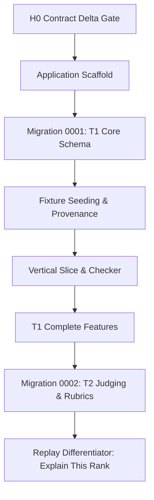

# Engineering Decisions, Challenges, & Solutions

> **Target Audience**: AI Agents, Human Engineers, and Dogfood Hackathon Judges.  
> **Status**: Living document updated after every verified checkpoint.  
> **Repository Baseline**: [Dogfood 2026 Submission Platform](file:///C:/Users/Administrator/Downloads/dogfood)

---

## 1. Executive Summary & Philosophy

Dogfood 2026 is an open-source, self-hostable hackathon submission and judging platform that must withstand automated evaluation (`run.py`), adversarial security checks, and manual judging scrutiny under strict offline conditions.

Our locked architectural priority is:
$$\text{Failing Test} \longrightarrow \text{Correctness Gap} \longrightarrow \text{Documentation Gap} \longrightarrow \text{Optional Enhancement}$$

We reject speculative abstractions, frontend framework overhead, runtime package downloads, and cloud dependencies. Every decision documented here directly serves **reproducibility, judging integrity, and verifiable correctness**.



---

## 2. Global Architecture & Stack Decisions

### 2.1 Pure Go with Zero CGo SQLite
* **Decision**: Pinned `modernc.org/sqlite v1.59.0` as the database driver, disabling CGo (`CGO_ENABLED=0`).
* **Rationale**:
  * Avoids dependency on a host C toolchain (gcc/clang/musl).
  * Enables building a fully static Linux amd64 binary.
  * Allows packaging into a minimal `FROM scratch` runtime container with zero system libraries.
* **Alternative Rejected**: `github.com/mattn/go-sqlite3` requires CGo, complicating cross-compilation and rendering `FROM scratch` impractical without dynamic libc bundling.

### 2.2 Standard Library First (`net/http`)
* **Decision**: Use Go's standard library `net/http` (with Go 1.22+ pattern routing like `GET /healthz` and `GET /{$}`) instead of external web frameworks (Gin, Fiber, Echo).
* **Rationale**:
  * Eliminates dependency supply-chain vulnerabilities.
  * Prevents external routing abstractions from drifting from HTTP standards.
  * Facilitates direct testability using `net/http/httptest`.

### 2.3 Embedded UI Assets (`embed.FS`)
* **Decision**: All HTML templates and CSS styles are embedded directly into the Go executable via `embed.FS` from [`web/`](file:///C:/Users/Administrator/Downloads/dogfood/web).
* **Rationale**:
  * Guarantees zero CDN requests and zero Node.js/npm build steps.
  * Enforces the hard offline requirement: the binary runs in air-gapped environments without missing assets.

### 2.4 Offline-First & `FROM scratch` Containerization
* **Decision**: Multi-stage [`Dockerfile`](file:///C:/Users/Administrator/Downloads/dogfood/Dockerfile) building a static Go binary, deployed into a `FROM scratch` image with `/fixtures.json` and a `/data` volume.
* **Rationale**:
  * Zero attack surface: no `/bin/sh`, no package manager, no curl/wget in the runtime image.
  * Container startup requires zero network calls and zero image pulls beyond local Docker daemon caches.

---

## 3. Checkpoint-by-Checkpoint Chronology & Challenges

### Checkpoint 1: Application Scaffold & Boot Infrastructure

#### Challenge 1.1: Healthcheck in a `FROM scratch` Container Without Shell
* **Problem**: Standard Docker Compose health checks rely on `curl`, `wget`, or `sh -c 'nc -z ...'`. In a `FROM scratch` image, none of these binaries exist.
* **Solution**: Implemented a native CLI subcommand in [`cmd/dogfood/main.go`](file:///C:/Users/Administrator/Downloads/dogfood/cmd/dogfood/main.go):
  ```powershell
  dogfood healthcheck
  ```
  This command performs a self-contained HTTP probe against `http://127.0.0.1:8080/healthz` using Go's standard HTTP client, exiting `0` on success and `1` on failure. The [`docker-compose.yml`](file:///C:/Users/Administrator/Downloads/dogfood/docker-compose.yml) directly runs:
  ```yaml
  healthcheck:
    test: ["CMD", "/dogfood", "healthcheck"]
  ```

#### Challenge 1.2: Go `embed.FS` Wildcards Before SQL Files Exist
* **Problem**: Go's compiler errors out with `pattern *.sql: no matching files found` if a `//go:embed *.sql` directive is declared before any SQL migration files are written.
* **Solution**: Designed [`internal/migrations/runner.go`](file:///C:/Users/Administrator/Downloads/dogfood/internal/migrations/runner.go) with an `ActiveFS fs.FS` variable that accepted runtime and test filesystems (e.g. `testing/fstest.MapFS`) during the initial scaffold phase, and cleanly wired `//go:embed *.sql` only when `0001_t1_core.sql` was authored.

---

### Checkpoint 2: Migration 0001 — T1 Core Schema

#### Challenge 2.1: Enforcing Forward-Only Migrations with Drift Protection
* **Problem**: Migration systems must prevent accidental mutation of historical migrations and avoid duplicate runs on container restarts.
* **Solution**: Created `schema_migrations` tracking:
  - `version` (INTEGER PRIMARY KEY)
  - `name` (TEXT NOT NULL)
  - `checksum_sha256` (TEXT NOT NULL)
  - `applied_at_utc` (TEXT NOT NULL)
  
  Each migration executes in an isolated transaction. Before execution, the runner verifies that previously recorded migrations have matching SHA-256 hashes. Any checksum drift immediately halts startup.

#### Challenge 2.2: Event Lifecycle Window Integrity
* **Problem**: Events have distinct lifecycle windows (registration, submissions, judging). Storing invalid timestamps could cause submission rejection logic to fail unexpectedly.
* **Solution**: Encoded table check constraints in [`0001_t1_core.sql`](file:///C:/Users/Administrator/Downloads/dogfood/internal/migrations/0001_t1_core.sql):
  - `chk_events_registration_window`
  - `chk_events_submissions_window`
  - `chk_events_judging_window`
  Each constraint ensures `open_at <= close_at` whenever both timestamps are present.

#### Challenge 2.3: Boundary Enforcement Against Scope Creep
* **Problem**: A common AI failure mode is creating T2 tables (`judge_profiles`, `assignments`, `rubric_versions`, `ballot_versions`) before T1 is verified.
* **Solution**: Strictly limited `0001_t1_core.sql` to the 11 core T1 tables. Added explicit assertions in [`internal/migrations/runner_test.go`](file:///C:/Users/Administrator/Downloads/dogfood/internal/migrations/runner_test.go) querying `sqlite_master` to guarantee that zero T2 tables exist.

---

### Checkpoint 3: Fixture Seeding & Data Fidelity

#### Challenge 3.1: Foreign Key Deadlock During Seeding
* **Problem**: When running `seed.Load`, SQLite threw `FOREIGN KEY constraint failed (787)`. The seed runner attempted to record a row in `seed_imports` with `event_id = 'evt_01'` before the `events` table contained `'evt_01'`.
* **Solution**: Developed a strict topological insertion order in [`internal/seed/seed.go`](file:///C:/Users/Administrator/Downloads/dogfood/internal/seed/seed.go):
  1. `events` (independent root entity)
  2. `seed_imports` (references `events(id)`)
  3. `tracks` (references `events(id)`)
  4. `users` (independent identity entity)
  5. `event_roles` (references `events(id)`, `users(id)`)
  6. `sessions` (references `users(id)`)
  7. `teams` (references `events(id)`, `users(id)`)
  8. `team_memberships` (references `events(id)`, `teams(id)`, `users(id)`)
  9. `projects` (references `events(id)`, `teams(id)`, `tracks(id)`)
  10. `submissions` (references `events(id)`, `projects(id)`)

#### Challenge 3.2: Duplicate Candidate Projects (Team `tm_07`)
* **Problem**: Official fixture inspection revealed that team `tm_07` has **two** projects:
  - `prj_07`: "Dry Harbour", submitted `2026-03-01T04:29:00Z`
  - `prj_41`: "Dry Harbour", submitted `2026-03-01T17:57:00Z`
  Many naive implementations enforce a `UNIQUE(team_id)` constraint on projects or silently overwrite/merge duplicate records.
* **Solution**:
  - Maintained schema flexibility: no `UNIQUE(team_id)` on `projects`.
  - Both `prj_07` and `prj_41` are imported as distinct project rows with their own version-1 submissions.
  - Added unit test assertions in [`internal/seed/seed_test.go`](file:///C:/Users/Administrator/Downloads/dogfood/internal/seed/seed_test.go) verifying that `tm_07` has exactly 2 separate projects and submissions.

#### Challenge 3.3: Handling Deferred Fixture Fields
* **Problem**: `official/fixtures.json` contains `scores` (126 entries) and `judges[].tracks`. Importing these into T1 would require distorting the schema or inventing temporary tables.
* **Solution**:
  - Judges are imported as `users` with an `event_roles` assignment (`role = 'judge'`).
  - Track eligibility lists and numeric scores are intentionally deferred until Migration 0002 (T2 judging schema), matching the modular migration architecture.

#### Challenge 3.4: Provenance, Line-Ending Drift, and Guard Against Silent Overwrites
* **Problem**: On Windows hosts where `core.autocrlf = true`, Git checked out `official/fixtures.json` converting LF (`\n`) to CRLF (`\r\n`). This increased file length from 46,687 bytes to 48,944 bytes and altered the raw SHA-256 hash from canonical `252896bc45d49fca69ad413be40c6bfde9d9b9f9dd8db702b3ff74eaaa181121` to `7a292e477f1f15abb280a7b485c01c66b7340ae955cba956b4e975b65ac5ef10`.
* **Solution**:
  1. Configured [`.gitattributes`](file:///C:/Users/Administrator/Downloads/dogfood/.gitattributes) with `official/* text eol=lf` to enforce LF on all platforms.
  2. Normalized `official/fixtures.json` on disk to restore exact byte-for-byte canonical LF representation (SHA-256: `252896bc...`).
  3. Added `CanonicalBytes(data)` newline normalization in [`internal/seed/seed.go`](file:///C:/Users/Administrator/Downloads/dogfood/internal/seed/seed.go) to guarantee that seed provenance hashing is resilient to Windows CRLF environments.
  4. If an existing database already completed a seed import with `CanonicalFixtureSHA256`, subsequent boots are verified no-ops (`AlreadySeeded = true`). If a differing fixture hash is provided on an already-seeded database, the loader halts to prevent silent data clobbering.

#### Challenge 3.5: Checker Authentication Compatibility
* **Problem**: The official test runner `run.py` does not use interactive login forms; it attaches explicit session cookies from `.dogfood.toml`.
* **Solution**: During seeding, pre-seeded evaluation sessions are created with SHA-256 hashed tokens matching `official/example.dogfood.toml`:
  - `organizer`: token `org_7f2a`
  - `judge_a`: token `jdg_a_91bc` (assigned to judge `jdg_01`)
  - `judge_b`: token `jdg_b_44de` (assigned to judge `jdg_02`)
  - `participant`: token `prt_2e88` (assigned to `tm_01` first member `priya1@example.org`)

---

## 4. Verification Matrix

| Checkpoint | Verified Property | Exact Command / Test | Status |
| :--- | :--- | :--- | :--- |
| **Scaffold** | Clean compilation | `go build ./...` | **PASS** |
| **Scaffold** | Health endpoint | `curl http://127.0.0.1:8080/healthz` | **PASS** (HTTP 200 `{"status":"ok"}`) |
| **Scaffold** | Binary healthcheck probe | `go run ./cmd/dogfood healthcheck` | **PASS** (exit code 0) |
| **Migration** | Empty DB execution | `TestRunner_EmptyDB` | **PASS** |
| **Migration** | Idempotency | `TestRunner_AppliesMigrationsAndIdempotency` | **PASS** |
| **Migration** | Checksum drift protection | `TestRunner_ChecksumMismatchFails` | **PASS** |
| **Migration** | T1 tables exist & T2 absent | `TestMigration0001_RealSchema` | **PASS** (11 tables verified, 0 T2 tables) |
| **Migration** | Foreign key enforcement | `PRAGMA foreign_keys = ON;` in `TestMigration0001_RealSchema` | **PASS** (invalid FK rejected) |
| **Seeding** | Exact entity counts | `TestSeed_OfficialFixtures` | **PASS** (1 evt, 8 trk, 40 tm, 41 prj, 122 usr, 4 ses) |
| **Seeding** | Duplicate candidate preservation | `SELECT COUNT(*) FROM projects WHERE team_id = 'tm_07'` | **PASS** (exactly 2 preserved) |
| **Seeding** | Second boot no-op | `Load` re-run in `TestSeed_OfficialFixtures` | **PASS** (`AlreadySeeded = true`, 0 duplicates) |
| **Seeding** | Hash mismatch defense | Mutated data in `TestSeed_OfficialFixtures` | **PASS** (rejected with clear error) |

---

## 5. Guide for Subsequent AI Agents & Developers

1. **Do not create T2 tables in `0001_t1_core.sql`**: All rubric, ballot, conflict, and assignment entities belong to `0002_t2_judging.sql`.
2. **Preserve ID format**: IDs in the fixture (`evt_01`, `trk_01`, `tm_01`, `prj_01`, `jdg_01`) must never be substituted with auto-incrementing integers.
3. **Always use parameterized queries**: Avoid string interpolation in SQL statements to prevent syntax errors and SQL injection.
4. **Maintain State**: Update [`prep/STATE.md`](file:///C:/Users/Administrator/Downloads/dogfood/prep/STATE.md) after passing any verification gate.
5. **Git Control**: Never commit or push autonomously. Always report suggested commit messages to the human developer.
