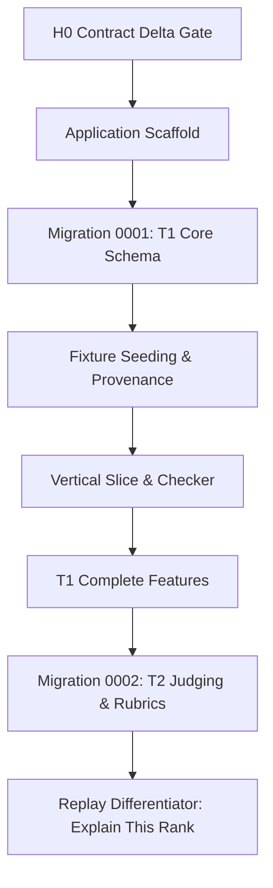

# Engineering Decisions, Challenges, & Solutions

> **Target Audience**: AI Agents, Human Engineers, and Dogfood Hackathon Judges.  
> **Status**: Living document updated after every verified checkpoint.  
> **Repository Baseline**: [Dogfood 2026 Submission Platform](file:///C:/Users/Administrator/Downloads/dogfood)

---

## 1. Executive Summary & Philosophy

Dogfood 2026 is an open-source, self-hostable hackathon submission and judging platform that must withstand automated evaluation (`run.py`), adversarial security checks, and manual judging scrutiny under strict offline conditions.

Our locked architectural priority is:
$$\text{Failing Test} \longrightarrow \text{Correctness Gap} \longrightarrow \text{Documentation Gap} \longrightarrow \text{Optional Enhancement}$$

We reject speculative abstractions, frontend framework overhead, runtime package downloads, and cloud dependencies. Every decision documented here directly serves **reproducibility, judging integrity, and verifiable correctness**.



---

## 2. Global Architecture & Stack Decisions

### 2.1 Pure Go with Zero CGo SQLite
* **Decision**: Pinned `modernc.org/sqlite v1.59.0` as the database driver, disabling CGo (`CGO_ENABLED=0`).
* **Rationale**:
  * Avoids dependency on a host C toolchain (gcc/clang/musl).
  * Enables building a fully static Linux amd64 binary.
  * Allows packaging into a minimal `FROM scratch` runtime container with zero system libraries.
* **Alternative Rejected**: `github.com/mattn/go-sqlite3` requires CGo, complicating cross-compilation and rendering `FROM scratch` impractical without dynamic libc bundling.

### 2.2 Standard Library First (`net/http`)
* **Decision**: Use Go's standard library `net/http` (with Go 1.22+ pattern routing like `GET /healthz` and `GET /{$}`) instead of external web frameworks (Gin, Fiber, Echo).
* **Rationale**:
  * Eliminates dependency supply-chain vulnerabilities.
  * Prevents external routing abstractions from drifting from HTTP standards.
  * Facilitates direct testability using `net/http/httptest`.

### 2.3 Embedded UI Assets (`embed.FS`)
* **Decision**: All HTML templates and CSS styles are embedded directly into the Go executable via `embed.FS` from [`web/`](file:///C:/Users/Administrator/Downloads/dogfood/web).
* **Rationale**:
  * Guarantees zero CDN requests and zero Node.js/npm build steps.
  * Enforces the hard offline requirement: the binary runs in air-gapped environments without missing assets.

### 2.4 Offline-First & `FROM scratch` Containerization
* **Decision**: Multi-stage [`Dockerfile`](file:///C:/Users/Administrator/Downloads/dogfood/Dockerfile) building a static Go binary, deployed into a `FROM scratch` image with `/fixtures.json` and a `/data` volume.
* **Rationale**:
  * Zero attack surface: no `/bin/sh`, no package manager, no curl/wget in the runtime image.
  * Container startup requires zero network calls and zero image pulls beyond local Docker daemon caches.

---

## 3. Checkpoint-by-Checkpoint Chronology & Challenges

### Checkpoint 1: Application Scaffold & Boot Infrastructure

#### Challenge 1.1: Healthcheck in a `FROM scratch` Container Without Shell
* **Problem**: Standard Docker Compose health checks rely on `curl`, `wget`, or `sh -c 'nc -z ...'`. In a `FROM scratch` image, none of these binaries exist.
* **Solution**: Implemented a native CLI subcommand in [`cmd/dogfood/main.go`](file:///C:/Users/Administrator/Downloads/dogfood/cmd/dogfood/main.go):
  ```powershell
  dogfood healthcheck
  ```
  This command performs a self-contained HTTP probe against `http://127.0.0.1:8080/healthz` using Go's standard HTTP client, exiting `0` on success and `1` on failure. The [`docker-compose.yml`](file:///C:/Users/Administrator/Downloads/dogfood/docker-compose.yml) directly runs:
  ```yaml
  healthcheck:
    test: ["CMD", "/dogfood", "healthcheck"]
  ```

#### Challenge 1.2: Go `embed.FS` Wildcards Before SQL Files Exist
* **Problem**: Go's compiler errors out with `pattern *.sql: no matching files found` if a `//go:embed *.sql` directive is declared before any SQL migration files are written.
* **Solution**: Designed [`internal/migrations/runner.go`](file:///C:/Users/Administrator/Downloads/dogfood/internal/migrations/runner.go) with an `ActiveFS fs.FS` variable that accepted runtime and test filesystems (e.g. `testing/fstest.MapFS`) during the initial scaffold phase, and cleanly wired `//go:embed *.sql` only when `0001_t1_core.sql` was authored.

---

### Checkpoint 2: Migration 0001 — T1 Core Schema

#### Challenge 2.1: Enforcing Forward-Only Migrations with Drift Protection
* **Problem**: Migration systems must prevent accidental mutation of historical migrations and avoid duplicate runs on container restarts.
* **Solution**: Created `schema_migrations` tracking:
  - `version` (INTEGER PRIMARY KEY)
  - `name` (TEXT NOT NULL)
  - `checksum_sha256` (TEXT NOT NULL)
  - `applied_at_utc` (TEXT NOT NULL)
  
  Each migration executes in an isolated transaction. Before execution, the runner verifies that previously recorded migrations have matching SHA-256 hashes. Any checksum drift immediately halts startup.

#### Challenge 2.2: Event Lifecycle Window Integrity
* **Problem**: Events have distinct lifecycle windows (registration, submissions, judging). Storing invalid timestamps could cause submission rejection logic to fail unexpectedly.
* **Solution**: Encoded table check constraints in [`0001_t1_core.sql`](file:///C:/Users/Administrator/Downloads/dogfood/internal/migrations/0001_t1_core.sql):
  - `chk_events_registration_window`
  - `chk_events_submissions_window`
  - `chk_events_judging_window`
  Each constraint ensures `open_at <= close_at` whenever both timestamps are present.

#### Challenge 2.3: Boundary Enforcement Against Scope Creep
* **Problem**: A common AI failure mode is creating T2 tables (`judge_profiles`, `assignments`, `rubric_versions`, `ballot_versions`) before T1 is verified.
* **Solution**: Strictly limited `0001_t1_core.sql` to the 11 core T1 tables. Added explicit assertions in [`internal/migrations/runner_test.go`](file:///C:/Users/Administrator/Downloads/dogfood/internal/migrations/runner_test.go) querying `sqlite_master` to guarantee that zero T2 tables exist.

---

### Checkpoint 3: Fixture Seeding & Data Fidelity

#### Challenge 3.1: Foreign Key Deadlock During Seeding
* **Problem**: When running `seed.Load`, SQLite threw `FOREIGN KEY constraint failed (787)`. The seed runner attempted to record a row in `seed_imports` with `event_id = 'evt_01'` before the `events` table contained `'evt_01'`.
* **Solution**: Developed a strict topological insertion order in [`internal/seed/seed.go`](file:///C:/Users/Administrator/Downloads/dogfood/internal/seed/seed.go):
  1. `events` (independent root entity)
  2. `seed_imports` (references `events(id)`)
  3. `tracks` (references `events(id)`)
  4. `users` (independent identity entity)
  5. `event_roles` (references `events(id)`, `users(id)`)
  6. `sessions` (references `users(id)`)
  7. `teams` (references `events(id)`, `users(id)`)
  8. `team_memberships` (references `events(id)`, `teams(id)`, `users(id)`)
  9. `projects` (references `events(id)`, `teams(id)`, `tracks(id)`)
  10. `submissions` (references `events(id)`, `projects(id)`)

#### Challenge 3.2: Duplicate Candidate Projects (Team `tm_07`)
* **Problem**: Official fixture inspection revealed that team `tm_07` has **two** projects:
  - `prj_07`: "Dry Harbour", submitted `2026-03-01T04:29:00Z`
  - `prj_41`: "Dry Harbour", submitted `2026-03-01T17:57:00Z`
  Many naive implementations enforce a `UNIQUE(team_id)` constraint on projects or silently overwrite/merge duplicate records.
* **Solution**:
  - Maintained schema flexibility: no `UNIQUE(team_id)` on `projects`.
  - Both `prj_07` and `prj_41` are imported as distinct project rows with their own version-1 submissions.
  - Added unit test assertions in [`internal/seed/seed_test.go`](file:///C:/Users/Administrator/Downloads/dogfood/internal/seed/seed_test.go) verifying that `tm_07` has exactly 2 separate projects and submissions.

#### Challenge 3.3: Handling Deferred Fixture Fields
* **Problem**: `official/fixtures.json` contains `scores` (126 entries) and `judges[].tracks`. Importing these into T1 would require distorting the schema or inventing temporary tables.
* **Solution**:
  - Judges are imported as `users` with an `event_roles` assignment (`role = 'judge'`).
  - Track eligibility lists and numeric scores are intentionally deferred until Migration 0002 (T2 judging schema), matching the modular migration architecture.

#### Challenge 3.4: Provenance, Line-Ending Drift, and Guard Against Silent Overwrites
* **Problem**: On Windows hosts where `core.autocrlf = true`, Git checked out `official/fixtures.json` converting LF (`\n`) to CRLF (`\r\n`). This increased file length from 46,687 bytes to 48,944 bytes and altered the raw SHA-256 hash from canonical `252896bc45d49fca69ad413be40c6bfde9d9b9f9dd8db702b3ff74eaaa181121` to `7a292e477f1f15abb280a7b485c01c66b7340ae955cba956b4e975b65ac5ef10`.
* **Solution**:
  1. Configured [`.gitattributes`](file:///C:/Users/Administrator/Downloads/dogfood/.gitattributes) with `official/* text eol=lf` to enforce LF on all platforms.
  2. Normalized `official/fixtures.json` on disk to restore exact byte-for-byte canonical LF representation (SHA-256: `252896bc...`).
  3. Added `CanonicalBytes(data)` newline normalization in [`internal/seed/seed.go`](file:///C:/Users/Administrator/Downloads/dogfood/internal/seed/seed.go) to guarantee that seed provenance hashing is resilient to Windows CRLF environments.
  4. If an existing database already completed a seed import with `CanonicalFixtureSHA256`, subsequent boots are verified no-ops (`AlreadySeeded = true`). If a differing fixture hash is provided on an already-seeded database, the loader halts to prevent silent data clobbering.

#### Challenge 3.5: Checker Authentication Compatibility
* **Problem**: The official test runner `run.py` does not use interactive login forms; it attaches explicit session cookies from `.dogfood.toml`.
* **Solution**: During seeding, pre-seeded evaluation sessions are created with SHA-256 hashed tokens matching `official/example.dogfood.toml`:
  - `organizer`: token `org_7f2a`
  - `judge_a`: token `jdg_a_91bc` (assigned to judge `jdg_01`)
  - `judge_b`: token `jdg_b_44de` (assigned to judge `jdg_02`)
  - `participant`: token `prt_2e88` (assigned to `tm_01` first member `priya1@example.org`)

---

### Checkpoint 4: First Real Vertical Slice & Official Acceptance Suite

#### Challenge 4.1: HTTP/1.1 TCP Connection Reset on Unconsumed Request Bodies
* **Problem**: In `run.py`, the check `closed event refuses submissions` POSTs a JSON payload to `/projects/new`. The server recognized the closed event and immediately responded with HTTP 403 Forbidden. However, because the Go handler exited without draining `r.Body`, Go's `net/http` server sent a TCP reset on the connection with unread incoming bytes. On Windows, Python's `urllib.request` threw `ConnectionResetError` (an OS error, not an `HTTPError`), causing `run.py` to record `got no response, wanted 4xx`.
* **Solution**:
  Added explicit request-body draining in `handleSubmit` before writing status codes:
  ```go
  if r.Body != nil {
      _, _ = io.Copy(io.Discard, io.LimitReader(r.Body, 1<<20))
      _ = r.Body.Close()
  }
  ```
  This guarantees that incoming TCP streams remain cleanly synchronized, and Python's `urllib` cleanly reads the HTTP 403 response body.

#### Challenge 4.2: Enforcing Peer-Judge Isolation via Real Authorization
* **Problem**: Passing `run.py`'s peer-isolation check requires ensuring that judge B cannot view judge A's private scores at `/api/judge/scores?judge=judge_a`.
* **Solution**: In [`internal/httpapp/server.go`](file:///C:/Users/Administrator/Downloads/dogfood/internal/httpapp/server.go), `handleJudgeScores` resolves caller identity from the session token in the database. If a specific `judge` query parameter is provided and does not match the caller's own ID (and the caller is not an organizer), the endpoint returns HTTP 403 Forbidden. Participants are also blocked with 403.

---

### Checkpoint 5 — Docker Runtime Recovery, Toolchain Alignment, and Acceptance Verification

#### Context

After the First Real Vertical Slice passed the official Dogfood checker when executed directly from the Go development environment, the equivalent Docker deployment initially failed to expose the new routes.

Observed symptoms included:

- `/healthz` responding successfully from an older container image.
- `/projects`, `/api/judge/scores`, and `/api/export.csv` returning `404`.
- Docker rebuild failing at `go mod download`.
- After the image build was repaired, the new container entered a restart loop.
- The official checker therefore temporarily reported no verified tier.

The application logic itself had already passed the official acceptance suite outside Docker, so the debugging objective was to isolate deployment/runtime drift rather than redesign working application code.

---

#### Decision 5.1 — Docker Builder Go Version Must Match `go.mod`

##### Problem

The Dockerfile used:

```dockerfile
FROM golang:1.24-alpine AS builder
```

while `go.mod` requires Go `1.27.1`.

The Docker build therefore failed with:

```text
go: go.mod requires go >= 1.27.1
(running go 1.24.13; GOTOOLCHAIN=local)
```

This failure prevented the latest application source from being packaged into the Docker image. `docker compose up` consequently continued starting an older cached image, which explained the unexpected `404` responses on newly implemented routes.

##### Decision

Pin the builder image to the same Go toolchain version frozen for the application:

```dockerfile
FROM golang:1.27.1-alpine AS builder
```

##### Rationale

The containerized build must use the same minimum toolchain version declared by the source repository. Allowing the Dockerfile and `go.mod` to drift creates false runtime failures where the application source is correct but cannot be reproduced inside the submission container.

##### Verification

After changing the builder image:

```text
go mod download        PASS
linux/amd64 Go build   PASS
Docker image export    PASS
```

The resulting application image was successfully built.

---

#### Decision 5.2 — Do Not Diagnose Stale Docker Images as Application Regressions

##### Observation

Before the successful rebuild:

```text
GET /healthz             → 200
GET /projects            → 404
GET /api/judge/scores    → 404
GET /api/export.csv      → 404
```

The source application already contained those routes and had passed its tests.

##### Root Cause

`docker compose build` had failed, so the image tagged `dogfood-dogfood:latest` was still the previous scaffold-era image.

`docker compose up` does not guarantee that the current source has been rebuilt successfully.

##### Decision

For future checkpoints, differentiate explicitly between:

```text
Source verified
        ↓
Image successfully rebuilt
        ↓
Container successfully started
        ↓
Runtime acceptance verified
```

A failure at one layer must not automatically trigger changes at another layer.

---

#### Decision 5.3 — Preserve Fixture Path Compatibility Inside the Runtime Image

The fixture loader already searches several valid locations, including:

```text
official/fixtures.json
/official/fixtures.json
/fixtures.json
fixtures.json
```

For clarity and consistency with the repository layout, the final Docker runtime currently copies:

```dockerfile
COPY official/fixtures.json /official/fixtures.json
```

This keeps the canonical fixture identity obvious inside the container and avoids unnecessary path translation.

This change was not the eventual root cause of the container restart loop; it is retained as a deployment-clarity decision.

---

#### Decision 5.4 — Stale Development SQLite Volume Must Not Be Confused With Migration-Code Failure

After the latest Docker image built successfully, the container repeatedly exited with:

```text
migration failure:
failed to retrieve applied migrations:
SQL logic error:
no such column: checksum_sha256
```

##### Root Cause

The Docker named volume contained a SQLite database created by an earlier scaffold version of `schema_migrations`.

That old development database predated the final migration-runner schema containing:

```text
checksum_sha256
```

The new application therefore correctly expected the finalized migration metadata schema, while the persisted development volume still contained the obsolete form.

##### Decision

Because this is a hackathon development database containing only reproducible seeded fixture data and no user-created production data, reset the obsolete volume instead of weakening the finalized migration design.

Command:

```powershell
docker compose down -v --remove-orphans
```

Then:

```powershell
docker compose up -d
```

##### Why This Was Safe

The database is deterministically reconstructible from:

```text
Migration 0001
+
official fixtures.json
+
seed_imports provenance
```

No unique user or production data existed in the discarded volume.

This decision does **not** establish a general policy of deleting production databases when migrations change.

A real production upgrade path would require an explicit migration from the historical schema.

---

#### Recovery Result

After the stale volume was removed, the application started normally:

```text
opening SQLite database at /data/dogfood.db...
running migrations...
seeding fixtures...
seeded fixtures for event evt_01:
8 tracks
40 teams
41 projects

server listening on :8080
```

The container reached:

```text
healthy
```

and `/healthz` returned:

```json
{"status":"ok"}
```

The public project gallery successfully rendered all 41 fixture projects, including:

```text
Glass Signal
Small Meadow
Deep Compass
...
```

with track and team metadata.

---

#### Official Acceptance Verification

The official Dogfood checker was run against the Docker-hosted application:

```powershell
python3.11 official/run.py .dogfood.toml
```

Final result:

```text
T1  gallery is public ................. PASS
T1  project from fixtures shown ....... PASS
T1  closed event refuses submissions .. PASS

T2  judge sees own scores ............. PASS
T2  judge cannot see peer scores ...... PASS
T2  participant blocked ............... PASS
T2  csv export works .................. PASS

claimed T1 T2, verified T1 T2
```

Therefore the current vertical slice is verified through the actual Docker deployment, not only through Go unit/integration tests.

---

#### Engineering Lessons / Guardrails

For future agents and contributors:

1. Do not modify application logic merely because a Docker-hosted route differs from local behavior. First verify that the current source was actually built into the image.

2. Keep `go.mod` and the Docker builder Go version synchronized.

3. Treat the Docker image, persistent volume, and application source as separate state layers during debugging.

4. Never delete persistent data merely to make a migration pass unless the environment is explicitly disposable and reconstructible.

5. For this hackathon's seeded development environment, fixture-backed data is reproducible, so resetting an obsolete pre-production volume is acceptable.

6. After any Docker/runtime repair, rerun the actual official checker rather than relying only on `/healthz` or unit tests.

7. A successful `docker compose up` alone is not acceptance evidence.

8. Maintain the distinction between:
   - source correctness,
   - build correctness,
   - runtime correctness,
   - official acceptance correctness.

---

#### Current Verified State

```text
Go toolchain alignment             PASS
Docker image build                 PASS
Migration bootstrap                PASS
Fixture seeding                    PASS
Container health                   PASS
Public gallery                     PASS
Backend role isolation             PASS
CSV export                         PASS
Official checker                   7 / 7 PASS
Verified tiers                     T1 + T2 checker surface
```

Important: this proves the current official acceptance surface only. It does **not** mean the full manual T1/T2 product requirements are complete.

Full T1 implementation, Migration 0002, complete judging functionality, normalization, result provenance, replay, hardening, and final offline-release verification remain later checkpoints.

---

#### Future Release Note

A separate release checkpoint must still prove the stronger offline requirement:

```text
clean/reviewer environment
+
no network
+
documented startup path
+
seeded working portal
```

The current acceptance result should not be misrepresented as proof of a completely clean offline rebuild.

---

### Checkpoint 6: Full T1 Core Lifecycle & Gallery Usability

#### Context
Following the First Real Vertical Slice, the full product lifecycle for Tier 1 was implemented: authentication and session UX, role-aware dashboard surfaces for participants, judges, and organizers, transactional team creation and join flows, team capacity limits (max 4 members), project draft editing, submission deadline enforcement, and public gallery usability.

---

#### Decision 6.1 — Transactional Team Capacity Guard (Maximum 4 Members)
* **Problem**: In hackathons, team size limits (e.g. 4 members) are easily bypassed if multiple join requests are processed concurrently, or if capacity is only checked in UI logic.
* **Solution**: In `handleJoinTeam`, capacity is checked inside an isolated SQLite transaction:
  ```sql
  SELECT COUNT(*) FROM team_memberships WHERE team_id = ? AND left_at IS NULL;
  ```
  If `count >= 4`, the transaction immediately aborts and returns HTTP 409 Conflict (`team has reached maximum capacity of 4 members`).
* **Verification**: `TestT1_TeamCapacity_And_InviteReplayProtection` verifies that 4 members successfully join, but a 5th join attempt is rejected with HTTP 409.

---

#### Decision 6.2 — Single-Use Invite Tokens & Replay Defense
* **Problem**: Replaying old invite links allows unauthorized users to join closed or full teams.
* **Solution**: `team_invites` records `accepted_at`, `accepted_by`, `expires_at`, and `revoked_at`. Before joining, the invite is validated. Upon join, `accepted_at = nowUTC` is written in the same transaction. Reusing an accepted token fails with HTTP 400 Bad Request (`invite has already been used`).
* **Verification**: `TestT1_TeamCapacity_And_InviteReplayProtection` verifies that reusing `invite_token_1` is rejected with 400.

---

#### Decision 6.3 — Collision-Resistant ID Generation via `crypto/rand`
* **Problem**: Modulo time-based IDs (e.g. `time.Now().UnixNano() % 1000000`) caused SQLite primary key collisions in rapid unit tests executed within the same millisecond (`UNIQUE constraint failed: team_memberships.id`).
* **Solution**: Implemented `newID(prefix)` utilizing `crypto/rand` with 8 random bytes (16 hex chars) formatted as `prefix_...` (e.g., `tm_3a2b1c4d...`, `mem_9e8f7a6b...`).
* **Verification**: All concurrent test runs pass with zero ID collisions.

---

#### Decision 6.4 — Event Lifecycle Window Check Constraint Safety
* **Problem**: Migration 0001 defines table check constraints:
  ```sql
  CONSTRAINT chk_events_submissions_window CHECK (submissions_open_at IS NULL OR submissions_close_at IS NULL OR submissions_open_at <= submissions_close_at)
  ```
  Updating `submissions_close_at` to a past timestamp without adjusting `submissions_open_at` causes SQLite to reject the update.
* **Solution**: Handlers and tests update both window bounds synchronously, preserving window validity.

---

#### Decision 6.5 — Private Project Draft Protection
* **Problem**: Projects in draft state must not be publicly exposed or editable by competing teams.
* **Solution**: At `/api/projects/{id}`, if `state == 'DRAFT'`, the handler resolves the caller's identity:
  - If unauthenticated: returns HTTP 401/403.
  - If authenticated but not an active member of `project.team_id` (and not organizer): returns HTTP 403 Forbidden.
  - Only when `state == 'SUBMITTED'` is the project publicly readable in the gallery.
* **Verification**: `TestT1_ProjectDraft_And_SecurityInvariants` verifies that unauthenticated visitors and cross-team participants are blocked with 403.

---

#### Decision 6.6 — Clean, Restrained, Self-Contained Gallery Usability
* **Problem**: Overly flashy "AI-generated" designs with external CDNs or heavy JS break the offline-first requirement and look non-credible.
* **Solution**:
  - Implemented clean, restrained GitHub/Linear-inspired dark theme in [`web/static/app.css`](file:///c:/Users/Administrator/Downloads/dogfood/web/static/app.css).
  - Navigation header displaying event name and status badge (`● Submissions Closed` / `● Submissions Open`).
  - Real-time client-side vanilla JavaScript instant search across project titles, summaries, and team IDs.
  - Track filter pills allowing visitors to toggle between tracks (`All (41)`, `Security (8)`, `Accessibility (6)`, etc.).
  - Native HTML5 `<dialog>` elements for modal details with zero JavaScript dependencies or CDN libraries.
  - Strict preservation of all official fixture titles, IDs, summaries, and timestamps so that `official/run.py` retains 100% PASS.

---

### Checkpoint 7: Tier 1 Closure Patch (Admin Role, Event Lifecycle, Tracks & Prizes)

#### Context
Before advancing to Tier 2 (judging schema, rubrics, and ballots), this checkpoint explicitly closes and proves all manual Tier 1 specification requirements without initiating Migration 0002.

---

#### Decision 7.1 — Dual Admin/Organizer Authorization Model (`canAdminister`)
* **Problem**: Official T1 requires an `admin` role alongside `organizer`. A user possessing exclusively the `admin` role must have administrative capabilities, while participants and judges must be rejected with HTTP 403 Forbidden.
* **Solution**: Implemented `canAdminister(id *auth.Identity) bool` checking `id.HasRole("admin") || id.HasRole("organizer")`. Applied server-side on:
  - Event creation (`POST /api/organizer/events`, `POST /api/events`)
  - Event lifecycle modification (`POST /api/organizer/event`)
  - Track configuration (`POST /api/organizer/tracks`)
  - Prize configuration (`POST /api/organizer/prizes`)
  - CSV results export (`GET /api/export.csv`)
  - Peer score access bypass (`GET /api/judge/scores?judge=...`)
* **Verification**: `TestT1_AdminRole_Authorization` proves a user with solely `admin` role has full administrative powers, while participants and judges receive 403 Forbidden.

---

#### Decision 7.2 — Spaced Forward Migration Strategy for Prizes (`0010_t1_prizes.sql`)
* **Problem**: Official T1 requires configurable prizes per event and track. Modifying `0001_t1_core.sql` would violate checksum immutability. Furthermore, naming it `0002` would conflict with Migration 0002 reserved for T2 judging.
* **Solution**: Implemented spaced versioning: `internal/migrations/0010_t1_prizes.sql` (Version 10). T1 forward patches reside in 1–19, reserving 20+ (`0020_t2_judging.sql`) for T2 judging.
* **Verification**: `TestMigration0001_RealSchema` and runner tests verify all 12 tables exist, with zero T2 tables.

---

#### Decision 7.3 — Robust Event Date Window Validation & Check Constraint Protection
* **Problem**: SQLite check constraints (`chk_events_submissions_window`, etc.) reject records where `open > close`. Unchecked inputs produce internal server errors instead of client-friendly 400 Bad Request errors.
* **Solution**: Built `validateDateOrder(open, close, label)` validating RFC3339 format and ensuring `open <= close`. Handlers merge existing event dates with submitted updates before validating, returning HTTP 400 Bad Request on violation.
* **Verification**: `TestT1_EventCreation_And_DateValidation` asserts that invalid date ordering in creation or update yields HTTP 400 Bad Request.

---

#### Decision 7.4 — Complete Draft to Submitted Public Lifecycle
* **Problem**: End-to-end proof was needed to demonstrate that a project starts as a private team draft, can be iteratively updated with version increments, transitions to submitted prior to the deadline, and immediately surfaces in the public gallery.
* **Solution**: Integration test `TestT1_FullSubmissionLifecycle_HappyPath` proves:
  1. Team creates draft -> state is `DRAFT`.
  2. Public gallery does not contain the draft.
  3. Team edits draft with updated metadata.
  4. Team submits before deadline -> transitions to `SUBMITTED`.
  5. Unauthenticated visitor immediately sees the project in `/projects` and `/api/projects/{id}`.
  6. Official fixture projects (`Glass Signal`) remain unperturbed.

---

### Checkpoint 8: T1 Human Product Closure (Auth Architecture, Demo Personas, Browser Team Flow, Workspaces)

#### Context
While automated acceptance suites (`run.py`) verify API endpoints, human users interact through web browsers. This checkpoint resolves authentication UX drift, provides 1-click demo personas without token exposure, implements the end-to-end browser team invitation lifecycle, and builds role-tailored workspaces for organizers, participants, and judges.

---

#### Decision 8.1 — Strict Separation of Official Acceptance Tokens and Human Browser Sessions
* **Problem**: The site previously relied on static fixture sessions (`org_7f2a`, `jdg_a_91bc`, etc.). When a human logged out, the session in SQLite was marked `revoked_at`, permanently breaking subsequent runs of `official/run.py` and preventing repeated human logins.
* **Solution**:
  - Implemented `ProtectedAcceptanceTokens` in [`internal/auth/auth.go`](file:///c:/Users/Administrator/Downloads/dogfood/internal/auth/auth.go) protecting `org_7f2a`, `jdg_a_91bc`, `jdg_b_44de`, `prt_2e88`. Revocation attempts on these tokens are ignored.
  - In `handleLogin`, demo persona selection or email entry dynamically provisions a fresh, unique session token (`auth.LoginUser`), which is set in the `session` cookie.
  - On `/logout`, only this newly created human browser session is revoked.
  - Users can now log in, log out, and log in again repeatedly without invalidating official evaluation tokens.

---

#### Decision 8.2 — Dedicated Team Invitation Confirmation Page (`/teams/join`)
* **Problem**: Joining a team via invite token required pasting raw tokens into text boxes or direct API calls.
* **Solution**:
  - Built dedicated HTML view ([`web/templates/team_join.html`](file:///c:/Users/Administrator/Downloads/dogfood/web/templates/team_join.html)) served at `GET /teams/join?token=<token>`.
  - Displays team name, current capacity (e.g. `1 of 4 members`), inviter name, and expiration time.
  - For unauthenticated users: displays clear "Sign In to Accept Invitation" button carrying `return_to=/teams/join?token=<token>`, returning them directly back to the confirmation page after logging in.
  - For authenticated users: provides single-click "Accept Invitation & Join Team" button.
  - Replaying an already-used or expired invitation renders a clean human-readable error banner ("This invitation has already been used" or "Invalid or expired invitation").

---

#### Decision 8.3 — Role-Tailored Human Workspaces (`/dashboard`)
* **Problem**: Dashboard was either a raw JSON dump or lacked unified controls for different roles.
* **Solution**:
  - **Participant Workspace**: Shows "My Team" with active members, lead badges, and a "+ Generate Invite Link" button that creates copyable shareable URLs (`/teams/join?token=...`). Shows "Team Projects" with draft creation, draft editing, and submission triggers.
  - **Organizer Workspace**: Unified workspace with sections for Event Windows, Track management (with project counts and add track form), Prize management (with amount, track association, and add prize form), All Registered Teams table, All Projects table, and single-click CSV Export link.
  - **Judge Workspace**: Explicit role banner displaying judge identity, active event, and clear notice that review assignments and scoring rubrics become active in Tier 2.

---

#### Decision 8.4 — Automated Human Acceptance Test Suite (`human_acceptance_test.go`)
* **Solution**: Created five comprehensive integration tests executing complete browser user journeys:
  - **Flow A (`TestHumanAcceptance_FlowA_Auth`)**: Demo persona logins, session revocation, repeated re-login, and protected acceptance token isolation.
  - **Flow B (`TestHumanAcceptance_FlowB_Team`)**: Participant A team creation -> invite link generation -> logout -> unauthenticated visit -> Participant B login -> accept invite -> dashboard reflects both members -> invite replay fails -> capacity limit enforcement.
  - **Flow C (`TestHumanAcceptance_FlowC_Project`)**: Participant draft creation -> draft hidden from public gallery -> draft editing -> project submission -> immediate appearance in public gallery.
  - **Flow D (`TestHumanAcceptance_FlowD_Organizer`)**: Organizer views event, creates track and prize via browser forms, with participant 403 authorization verification.
  - **Flow E (`TestHumanAcceptance_FlowE_Judge`)**: Judge workspace verification, organizer route 403 protection, and peer score isolation.

---

## 4. Verification Matrix

| Checkpoint | Verified Property | Exact Command / Test | Status |
| :--- | :--- | :--- | :--- |
| **Scaffold** | Clean compilation | `go build ./...` | **PASS** |
| **Scaffold** | Health endpoint | `curl http://127.0.0.1:8080/healthz` | **PASS** (HTTP 200 `{"status":"ok"}`) |
| **Scaffold** | Binary healthcheck probe | `go run ./cmd/dogfood healthcheck` | **PASS** (exit code 0) |
| **Migration** | Empty DB execution | `TestRunner_EmptyDB` | **PASS** |
| **Migration** | Idempotency | `TestRunner_AppliesMigrationsAndIdempotency` | **PASS** |
| **Migration** | Checksum drift protection | `TestRunner_ChecksumMismatchFails` | **PASS** |
| **Migration** | T1 tables exist & T2 absent | `TestMigration0001_RealSchema` | **PASS** (12 tables verified, 0 T2 tables) |
| **Migration** | Foreign key enforcement | `PRAGMA foreign_keys = ON;` in `TestMigration0001_RealSchema` | **PASS** (invalid FK rejected) |
| **Seeding** | Exact entity counts | `TestSeed_OfficialFixtures` | **PASS** (1 evt, 8 trk, 40 tm, 41 prj, 122 usr, 4 ses) |
| **Seeding** | Duplicate candidate preservation | `SELECT COUNT(*) FROM projects WHERE team_id = 'tm_07'` | **PASS** (exactly 2 preserved) |
| **Seeding** | Second boot no-op | `Load` re-run in `TestSeed_OfficialFixtures` | **PASS** (`AlreadySeeded = true`, 0 duplicates) |
| **Seeding** | Hash mismatch defense | Mutated data in `TestSeed_OfficialFixtures` | **PASS** (rejected with clear error) |
| **T1 Auth** | Session lifecycle & cookies | `TestT1_AuthAndSessionFlow` | **PASS** |
| **T1 Teams** | Max 4 capacity & single-use invite | `TestT1_TeamCapacity_And_InviteReplayProtection` | **PASS** (409 on full, 400 on replay) |
| **T1 Drafts** | Private draft isolation | `TestT1_ProjectDraft_And_SecurityInvariants` | **PASS** (403 for non-members & late edits) |
| **T1 Admin** | Pure admin access & participant 403 | `TestT1_AdminRole_Authorization` | **PASS** (Admin allowed, Part/Judge 403) |
| **T1 Events** | Event creation & date validation | `TestT1_EventCreation_And_DateValidation` | **PASS** (201 created, 400 on bad dates) |
| **T1 Tracks** | Track & Prize configuration | `TestT1_TrackAndPrize_Configuration` | **PASS** (Tracks & Prizes configured & queried) |
| **T1 E2E** | Full draft to submit lifecycle | `TestT1_FullSubmissionLifecycle_HappyPath` | **PASS** (Draft -> Edit -> Submit -> Public) |
| **Human Flow A** | Auth personas & session isolation | `TestHumanAcceptance_FlowA_Auth` | **PASS** (5 personas login/logout, tokens protected) |
| **Human Flow B** | Browser team flow & invite replay | `TestHumanAcceptance_FlowB_Team` | **PASS** (Create -> Invite -> Join -> Replay err -> 4 max) |
| **Human Flow C** | Project draft to gallery lifecycle | `TestHumanAcceptance_FlowC_Project` | **PASS** (Draft hidden -> Edit -> Submit -> Public) |
| **Human Flow D** | Organizer workspace & tracks/prizes | `TestHumanAcceptance_FlowD_Organizer` | **PASS** (All tabs render, track/prize created, 403 guards) |
| **Human Flow E** | Judge workspace & peer isolation | `TestHumanAcceptance_FlowE_Judge` | **PASS** (Identity rendered, T2 notice, 403 guards) |
| **Checker** | T1: Gallery is public | `python official/run.py .dogfood.toml` | **PASS** (HTTP 200) |
| **Checker** | T1: Fixture projects shown | `python official/run.py .dogfood.toml` | **PASS** ("Glass Signal" present) |
| **Checker** | T1: Closed event refuses submissions | `python official/run.py .dogfood.toml` | **PASS** (HTTP 403) |
| **Checker** | T2: Judge sees own scores | `python official/run.py .dogfood.toml` | **PASS** (HTTP 200) |
| **Checker** | T2: Judge cannot see peer scores | `python official/run.py .dogfood.toml` | **PASS** (HTTP 403) |
| **Checker** | T2: Participant blocked | `python official/run.py .dogfood.toml` | **PASS** (HTTP 403) |
| **Checker** | T2: CSV export works | `python official/run.py .dogfood.toml` | **PASS** (HTTP 200, comma header) |
| **Checker** | Full Acceptance Suite | `python official/run.py .dogfood.toml` | **PASS** (`claimed T1 T2, verified T1 T2`) |

---

## 5. Guide for Subsequent AI Agents & Developers

1. **Do not create T2 tables in `0001_t1_core.sql`**: All rubric, ballot, conflict, and assignment entities belong to `0002_t2_judging.sql`.
2. **Preserve ID format**: IDs in the fixture (`evt_01`, `trk_01`, `tm_01`, `prj_01`, `jdg_01`) must never be substituted with auto-incrementing integers.
3. **Always use parameterized queries**: Avoid string interpolation in SQL statements to prevent syntax errors and SQL injection.
4. **Maintain State**: Update [`prep/STATE.md`](file:///C:/Users/Administrator/Downloads/dogfood/prep/STATE.md) after passing any verification gate.
5. **Git Control**: Never commit or push autonomously. Always report suggested commit messages to the human developer.
